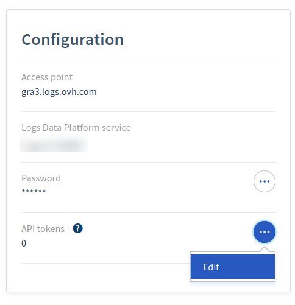
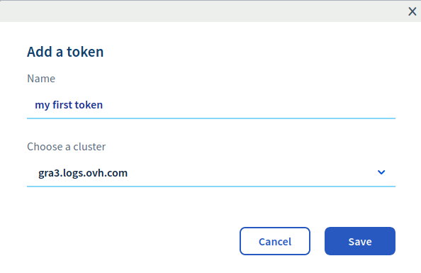

**Last updated 23rd july, 2020**

## Objective

With Logs Data Platform, there are 3 ways to query your logs.

- The [Graylog Web Interface](https://gra1.logs.ovh.com){.external}
- The [Graylog API](https://gra1.logs.ovh.com/api/api-browser#!/Search/Relative){.external}
- The [Elasticsearch API](https://www.elastic.co/guide/en/elasticsearch/reference/current/search.html){.external} located at the port 9200 of your cluster (find its address in the **Home** Page) against your [alias](../using_kibana_with_logs/guide.en-gb.md){.ref}.
 
So you can pop up a [Kibana](../using_kibana_with_logs/guide.en-gb.md){.ref} or a [Grafana](../using_grafana_with_logs/guide.en-gb.md){.ref} or even [a terminal Dashboard for Graylog](https://github.com/Graylog2/cli-dashboard){.external}.

All these accesses are secured by your username and password. But what if you don't want to put your Logs Data Platform credentials everywhere? You can just use tokens to access all these endpoints and revoke them anytime you want. This tutorial is here to tell you how.


## Requirements

- No specific requirements


## Instructions

### Generating tokens using the manager

Once you have logged into Logs Data Platform you will have to access to the token Generation panel from the Configuration box.

{.thumbnail}

On this page you will have the possibility to create a token and to remove them. Note that you cannot modify a token.

{.thumbnail}

Once the token is created, you can use its value or remove it:

{.thumbnail}

### Generating tokens with API

One goal with token is to automatize APIs call. Sometime you even need to automatize token creation. That's why it is possible to create token by using only the OVH APIs. If you're familiar with the OVH API, it should be fairly straightforward, if you're not, this section will help you with it. Generating tokens is two API calls away. You can use the OVH API console to make theses calls.

First you will have to retrieve the serviceName you want to generate token for. The API call to get your serviceName is the following:

>[!faq]
>
> Endpoint:
>
>> > [!api]
>> >
>> > @api {GET} /dbaas/logs
>> >
>>
>
> About:
>
>> List available services.

If you want to know what is the Logs Data Platform username associated with this serviceName, use the following call:

>[!faq]
>
> Endpoint:
>
>> > [!api]
>> >
>> > @api {GET} /dbaas/logs/{serviceName}
>> >
>>
>
> About:
>
>> Return the service object of connected identity.
> 
> Parameters:
>> serviceName *
>>> The internal ID of your Logs Data Platform service (string)

Once you have the login you want, use:

>[!faq]
>
> Endpoint:
>
>> > [!api]
>> >
>> > @api {POST} /dbaas/logs/{serviceName}/token
>> >
>>
>
> About:
>
>> Add a new token.
> 
> Parameters:
>> serviceName *
>>> The internal ID of your Logs Data Platform service (string)
>> name *
>>> The name of your token (string)

Please replace **serviceName** with your serviceName, and replace **name** by the name of your choice for your token. This call will give you a taskId. After a few seconds you can retrieve your **tokenId** with this call:

>[!faq]
>
> Endpoint:
>
>> > [!api]
>> >
>> > @api {GET} /dbaas/logs/{serviceName}/token
>> >
>>
>
> About:
>
>> Return the list of service tokens.
> 
> Parameters:
>> serviceName *
>>> The internal ID of your Logs Data Platform service (string)

This will give you back the id of your token. The actual value of the token can be retrieved with:

>[!faq]
>
> Endpoint:
>
>> > [!api]
>> >
>> > @api {GET} /dbaas/logs/{serviceName}/token/{tokenId}
>> >
>>
>
> About:
>
>> Return the specified token.
> 
> Parameters:
>> serviceName *
>>> The internal ID of your Logs Data Platform service (string)
>> tokenId *
>>> UUID of your token (string)

Here is the final response you will get.

```json
{
    "updatedAt": "2016-12-01T12:30:26.566986+00:00",
    "createdAt": "2016-12-01T12:30:26.566939+00:00",
    "value": "kujg9g227qv0123mav3s0q4pra4psqsi5leka6j7lc62qdef58q",
    "name": "token_name",
    "tokenId": "XXXXXXXXXXXXXXXXXXXXXXXXXXX"
}
```

The token value is the value field. That is the field you will need to use the Logs Data Platform Search APIs.

Finally to delete your token, use the following call:

>[!faq]
>
> Endpoint:
>
>> > [!api]
>> >
>> > @api {DELETE} /dbaas/logs/{serviceName}/token/{tokenId}
>> >
>>
>
> About:
>
>> Delete the specified token.
> 
> Parameters:
>> serviceName *
>>> The internal ID of your Logs Data Platform service (string)
>> tokenId *
>>> UUID of your token (string)

### Using your tokens

Using your token is no different of using your credentials. You just have to replace your username with your token and your password with the word **token**.
For example to issue a search against the Graylog API with the token obtained above, you can do the following:


```shell-session
$ curl -u kujg9g227qv0123mav3s0q4pra4psqsi5leka6j7lc62qdef58q:token -XGET "https://<your_cluster>.logs.ovh.com/api/search/universal/relative?query=*&range=300&filter=streams:a123aebc12345623aafd"
```

Note that you have to replace the stream value in the filter parameter by the Id of your stream.

To issue a search against the Elasticsearch API, you also use the same credentials.

```shell-session
$ curl -u kujg9g227qv0123mav3s0q4pra4psqsi5leka6j7lc62qdef58q:token "https://<your_cluster>.logs.ovh.com:9200/your_alias/_search?pretty"
```

This call will launch a quick search (to retrieve the count and a sample of your documents) against the alias **your_alias**. Replace the alias by the one you have setup in you Logs Data Platform console. Note that these credentials are usable in place of your account credentials in Kibana and Grafana (or any tool that support Basic Authentication with Elasticsearch).

The only place you cannot use your token is the Graylog Web Interface.

## Go further

- Getting Started: [Quick Start](../quick_start/guide.en-gb.md){.ref}
- Documentation: [Guides](../product.en-gb.md){.ref}
- Community hub: [https://community.ovh.com](https://community.ovh.com/en/c/Platform){.external}
- Create an account: [Try it!](https://www.ovh.com/fr/order/express/#/express/review?products=~(~(planCode~'logs-account~productId~'logs)){.external}

